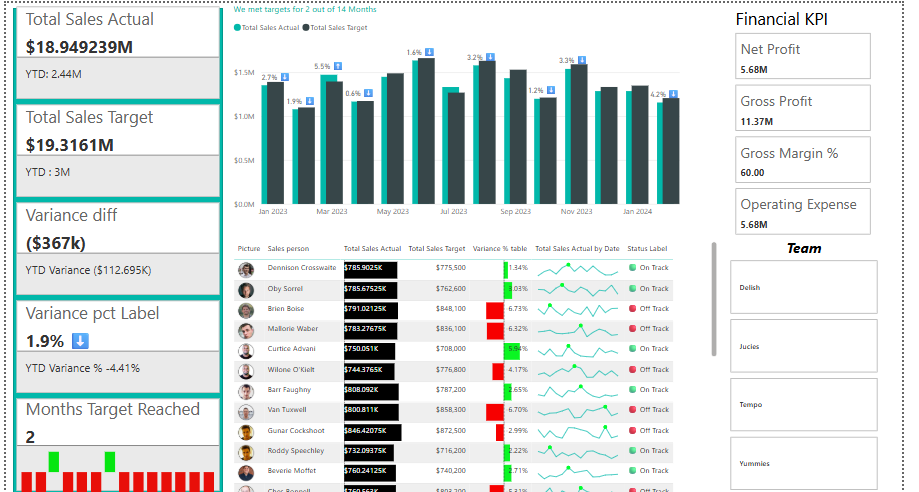

# 📊 Financial KPI & Sales Performance Dashboard

An interactive Power BI dashboard for tracking monthly and YTD sales performance against targets, with deep financial insights.

---

## 🚀 Features

- 📈 Monthly & YTD performance tracking against sales targets
- 🔗 Integrated multiple data sources with unified data model
- 🧮 Custom DAX measures for variance, YTD, and trend analysis
- ⚠️ Conditional formatting to highlight underperformance
- 📊 Visual-driven design for quick insights and strategic decisions
- 🤝 Self-service BI tool for finance and sales teams

---

## 🛠️ Technology Used

- Power BI Desktop
- DAX (Data Analysis Expressions)
- Excel / CSV (as data sources)
- SQL Server / SharePoint (if applicable)
- Power Query
## 🖼️ Screenshots

### Dashboard Overview  


## 🧩 How to Use

1. Clone the repository  
   ```bash
   git clone https://github.com/DivyamTalreja0505/project4.git
   
2.Open Financial-Dashboard.pbix in Power BI Desktop

3.Load your own data or review with the sample dataset provided

4.Refresh the data and explore filters, slicers, and KPIs
